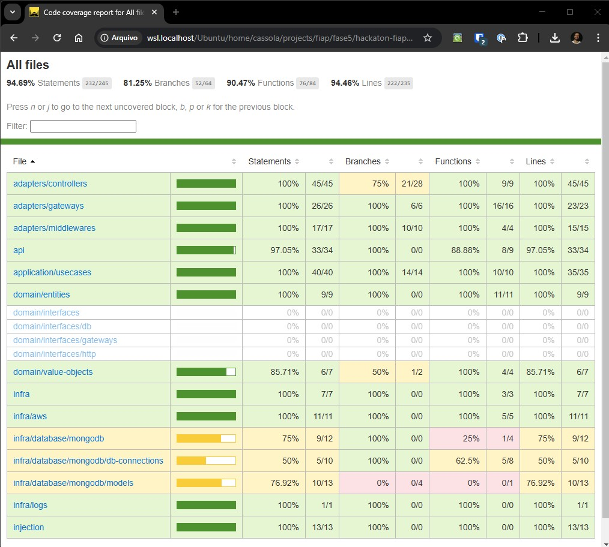
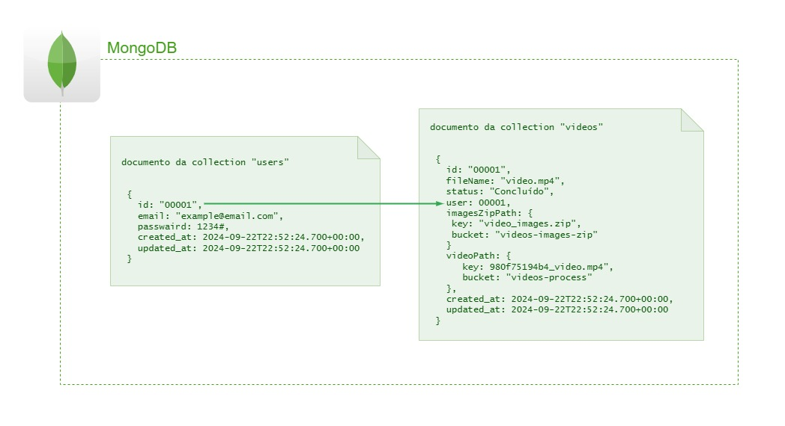
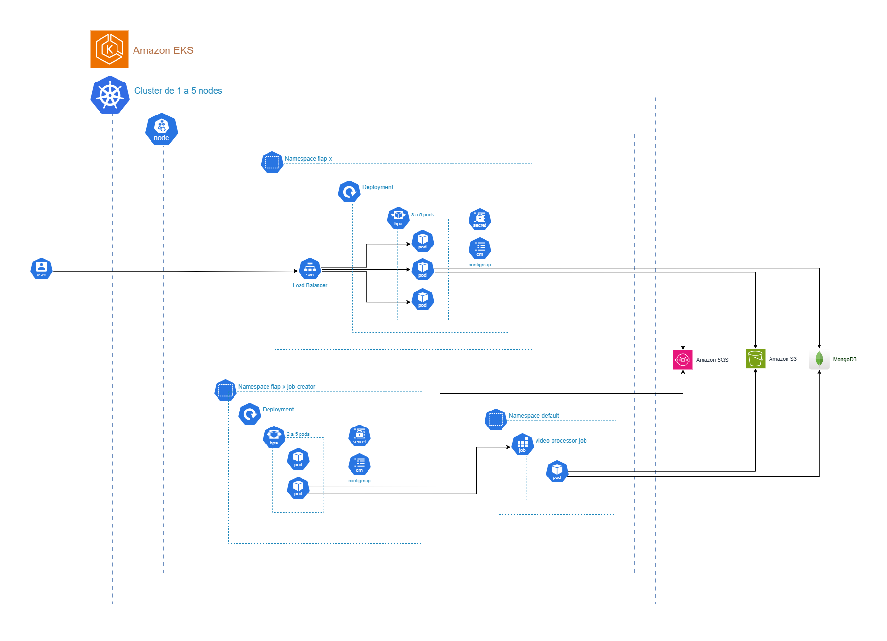

# FIAP X App
> Projeto do curso de pós graduação da FIAP

## Upload de vídeos
- O vídeo não pode ser maior do que 100MB

## Requisitos para deploy
- Banco de dados em produção
- Cluster EKS em produção

## Secrets
Secrets cadastradas no repositório do GitHub

```bash
AWS_REGION
AWS_ACCESS_KEY_ID
AWS_SECRET_ACCESS_KEY
AWS_SESSION_TOKEN
MONGODB_CONNECTION_STRING
DOCKERHUB_TOKEN
JWT_SECRET
QUEUE_URL
BUCKET_VIDEOS_NAME
BUCKET_IMAGES_ZIP_NAME
```

## Como rodar o projeto local?
### Docker compose
- Para iniciar
```bash
docker compose up
```
- Para encerrar
```bash
docker compose down
```

## Como acessar a documentação?
```
http://localhost:3000/docs
```

### Arquivo yaml do swagger
[fiap-x-app-swagger-with-servers.yaml](./docs/fiap-x-app-swagger-with-servers.yaml)

## Endpoints

### Auth routes

| Method | Endpoint           | Description       |
| ------ | ------------------ | ----------------- |
| POST   | `/auth/login`      | login do usuário  |


### User routes

| Method | Endpoint                   | Description          |
| ------ | -------------------------- | -------------------- |
| POST   | `/user`                    | Criar usuário        |

### Video routes

| Method | Endpoint                      | Description                 |
| ------ | ----------------------------- | --------------------------- |
| GET    | `/videos`                     | Todos os vídeo do usuário   |
| GET    | `/videos/:id`                 | Um vídeo do usuário         |
| GET    | `/videos/:id/download/images` | Solicita link para download |
| POST   | `/videos/upload`              | Upload de vídeo             |

<br />


## Evidência de cobertura de testes


## Desenho da modelagem banco de dados


## Desenho da arquitetura

